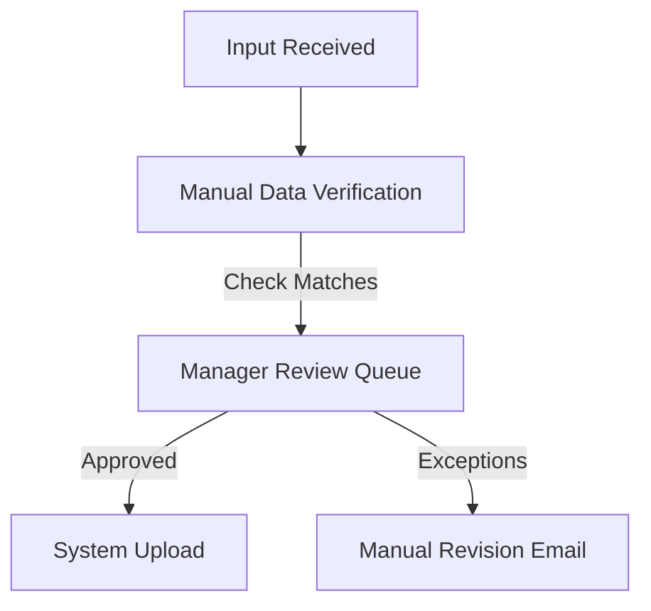

# AI Forward Deployed Engineer (AI FDE) Fundamentals: Business Understanding


This document serves as the comprehensive master reference manual for **Phase 2: Business Understanding**, taking you from beginner concepts to enterprise-grade execution in discovery, process mapping, requirements gathering, stakeholder alignment, and business value realization.

---

# Phase 2: Business Understanding

---

## Module 1: Business Discovery

### 1. Detailed Theory & Taxonomy
Business Discovery is the systematic phase of identifying, investigating, and documenting the current state of a client's business operations, systems, and structures. It establishes the baseline context from which all future AI interventions will be mapped, estimated, and implemented.

```
[Contextual Ingestion] ➔ [Current State Assessment (As-Is)] ➔ [Future State Visioning (To-Be)] ➔ [Gap Analysis]
```

#### Key Dimensions of Business Discovery:
*   **As-Is State Assessment:** Mapping workflows, operational cycle times, system dependencies, data accessibility, and process bottlenecks as they exist today.
*   **To-Be Visioning:** Designing the target operational environment where AI handles cognitive workloads, defining human-in-the-loop (HITL) checkpoints, and setting throughput goals.
*   **Business Context Analysis:** Aligning the technical initiative with organizational priorities (e.g., cost-cutting, market expansion, regulatory compliance).

---

### 2. Enterprise Framework: The As-Is vs. To-Be Discovery Matrix
FDEs use this framework to structure discovery workshops:
```
+------------------+----------------------------------+----------------------------------+
| Dimension        | As-Is (Current State)            | To-Be (Target Vision)            |
+------------------+----------------------------------+----------------------------------+
| Processes        | High-latency manual review steps | AI-assisted sorting & routing     |
| Systems & Tools  | Split legacy systems, no sync    | Integrated API gateway, unified UI|
| Data Assets      | Unstructured PDFs, email attachments| Auto-structured schemas, vector DB|
| Human Roles      | Operators do manual copy-paste   | Operators act as final approvers |
+------------------+----------------------------------+----------------------------------+
```

---

### 3. Industry Examples & Real Business Scenarios
*   **Banking (Mortgage Processing):** Discovery reveals that loan underwriters spend 40% of their time cross-checking bank statement PDFs against income declarations in tax forms.
*   **Healthcare (Pre-Authorization):** Medical review teams manually parse clinical notes against insurance coverage guidelines, leading to a 3-day backlog in procedure approvals.

---

### 4. Checklists & Templates
#### FDE Discovery Workshop Agenda Checklist
- [ ] **Sponsor Kickoff (15 min):** Align team on business drivers and target outcomes.
- [ ] **Operator Shadowing (DITL - 2 hours):** Record and clock actual steps in the core workflow.
- [ ] **Technical Systems Auditing (1 hour):** Map data storage locations, APIs, and firewall rules.
- [ ] **To-Be Workshop (1.5 hours):** Wireframe the proposed UI/UX integration with end users.

#### Discovery Intake Questionnaire Template
```markdown
### AI Opportunity Intake Form
1. **Process Owner:** [Name / Department]
2. **Current Business Bottleneck:** [Describe what is slow or expensive]
3. **Core Systems Involved:** [e.g., Salesforce CRM, On-prem DB, SharePoint]
4. **Data Formats:** [ ] Structured (SQL)  [ ] Semi-structured (JSON/CSV)  [ ] Unstructured (PDF/Word/Voice Logs)
5. **Volume Metrics:** [e.g., 50,000 documents per month]
```

---

### 5. Discovery Questions & Stakeholder Conversations
*   *FDE to Database Admin (DBA):* "Where does the transaction audit log live, and does our application have read access to it via a REST API, or do we need to set up a database replica?"
*   *DBA:* "It's on an Oracle DB. Direct access is blocked, but we can export transactional delta batches to a secure S3 bucket every hour."
*   *FDE:* "Excellent. We will configure our ingestion pipeline to poll that S3 bucket, preventing any performance impact on your primary transactional database."

---

### 6. Case Study: Insurance Claims Ingestion Discovery
An FDE ran discovery for a property insurer receiving handwritten accident statements. By auditing their physical mailroom, the FDE identified that processing statements took an average of 48 hours. Mapping the pipeline showed that OCR alone was insufficient due to varied handwriting styles. The FDE proposed an intake system using an specialized OCR engine followed by a corrective LLM, reducing initial triage time to 15 minutes.

---

### 7. Interview Questions & Common Mistakes
*   **Interview Question:** "During discovery, a client tells you they don't have API documentation for their core booking system. How do you design an integration?"
*   **Common Mistake:** Suggesting you will write custom reverse-engineered wrappers without access to the environment. The correct FDE response is to suggest a middleware service layer, database polling patterns, or leveraging an RPA (Robotic Process Automation) agent to bridge the gap while planning a long-term API path.

---

### 8. AI FDE Deliverable: Discovery Report
The output of this phase is a formal **Discovery Report** summarizing:
1.  As-Is Workflow Map
2.  System Connectivity Constraints
3.  Target Data Architecture
4.  Identified Risks & Recommended Next Steps

---

## Module 2: Industry Understanding

### 1. Detailed Theory
To win stakeholder trust, an FDE must speak the specific language of the client's industry. Enterprise architectures, compliance hurdles, and core KPIs vary dramatically between sectors.

#### Industry Analysis Vectors:
*   **Competitive Landscape:** Understand market pressures (e.g., margins in retail vs. customer acquisition costs in SaaS).
*   **Regulatory Environment:** Highly regulated industries (Banking: SEC, FINRA; Healthcare: HIPAA, FDA) require different system guardrails compared to unregulated sectors.
*   **Market Dynamics:** Identifying whether an industry is undergoing consolidation, digitizing legacy records, or facing workforce shortages.

---

### 2. Industry Analysis Profiles
#### Banking & Financial Services
*   **Structure:** Retail, Commercial, Investment Banking, Wealth Management.
*   **Core Systems:** Core Banking Systems (e.g., FIS, Fiserv), Transaction Ledgers, KYC/AML Databases.
*   **Regulations:** GDPR, HIPAA, SOC2, PCI-DSS, Basel III compliance.
*   **Core KPIs:** Cost-to-Income Ratio, Net Interest Margin (NIM), Loan Processing cycle time, Error Rates.

#### Insurance
*   **Structure:** Life, Property & Casualty (P&C), Health Insurance.
*   **Core Systems:** Policy Administration Systems (Guidewire), Claims Databases, Underwriting Engines.
*   **Regulations:** State insurance commissioners, Solvency II.
*   **Core KPIs:** Combined Ratio, Average Handle Time (AHT) for claims, Claims loss ratio, Underwriting throughput.

#### Healthcare & Life Sciences
*   **Structure:** Providers (Hospitals), Payors (Insurers), Pharma, MedTech.
*   **Core Systems:** Electronic Health Records (Epic, Cerner), PACS (Imaging).
*   **Regulations:** HIPAA, HITECH, FDA approvals.
*   **Core KPIs:** Readmission Rates, Average Length of Stay (ALOS), Billing Denials, Time-to-Treatment.

#### Retail & E-Commerce
*   **Structure:** Direct-to-Consumer (D2C), Brick & Mortar, Marketplace.
*   **Core Systems:** Inventory Management, POS Systems, CRM (Salesforce), ERP (SAP).
*   **Core KPIs:** Customer Lifetime Value (LTV), Churn Rate, Cart Abandonment Rate, Inventory Turnover.

#### Logistics & Supply Chain
*   **Structure:** 3PL, Freight Forwarders, Warehousing, Last-Mile Delivery.
*   **Core Systems:** Warehouse Management Systems (WMS), Transportation Management Systems (TMS), ERP.
*   **Core KPIs:** On-Time In-Full (OTIF) Delivery, Warehouse Capacity Utilization, Route Efficiency, Fuel Costs.

---

### 3. Enterprise Framework: The Industry Taxonomy Mapping Tool
Before kicking off an engagement, FDEs use this framework to catalog client-specific terminology:
```
+------------------+-----------------------------+------------------------------------+
| Industry         | Common Terminology          | Underlying Technical Entity        |
+------------------+-----------------------------+------------------------------------+
| Insurance        | First Notice of Loss (FNOL)  | Ingestion Trigger / Initial Ticket |
| Healthcare       | Prior Auth                  | Regulatory Compliance Document     |
| Banking          | KYC/AML Screening           | Identity Verification JSON payload  |
| Retail           | SKU Inventory Delta         | Stock Level Record Database Entry  |
+------------------+-----------------------------+------------------------------------+
```

---

### 4. Checklists & Templates
#### Pre-Kickoff Industry Analysis Checklist
- [ ] Research top 3 market competitors and their public AI announcements.
- [ ] Review regulatory constraints (e.g., does the model output need to be fully auditable for compliance?).
- [ ] Identify industry-standard KPIs to target.
- [ ] Locate the client's internal data dictionary or business glossaries.

---

### 5. Discovery Questions & Stakeholder Conversations
*   *FDE:* "Given HIPAA regulations, how do we plan to handle patient names and Social Security Numbers when passing clinical transcripts to the summarization engine?"
*   *Client Compliance Officer:* "All PII must be stripped or masked on-premises before any data leaves our secure server boundaries."
*   *FDE:* "Understood. We will implement a local, rules-based de-identification pipeline using Regex patterns and Entity Recognition models to mask SSNs, names, and phone numbers prior to inference."

---

### 6. Interview Questions & Common Mistakes
*   **Interview Question:** "You are building a loan risk assessment tool for a retail bank. How do you ensure the model doesn't introduce discriminatory bias?"
*   **Common Mistake:** Saying, "I will remove gender and race columns from the database." You must also audit proxy variables (e.g., zip codes, education history) that can correlate with demographic data, and establish model fairness and explainability checks.

---

## Module 3: Domain Knowledge Acquisition

### 1. Detailed Theory
Domain knowledge represents the deep understanding of a functional area within a business (e.g., Procurement, HR, Field Sales, Treasury). An FDE must absorb domain context rapidly without having a background in that field.

#### Methods of Acquisition:
1.  **SME (Subject Matter Expert) Interviews:** Structured interviews to extract the expert's mental model.
2.  **Process Observation:** Shadowing users in action to identify steps, workarounds, and unwritten operational habits.
3.  **Documentation Analysis:** Reading policy manuals, database schemas, training guidelines, and historic support tickets.

---

### 2. Domain Learning Playbook: The SME Interview Guide
Structure your sessions to capture structural patterns rather than trivia:
*   **Establish the Scope:** "Walk me through the lifecycle of a purchase order, from generation to final invoice matching."
*   **Identify Exceptions:** "What happens when an invoice has a different quantity than the purchase order? Who reviews it, and how is it resolved?"
*   **Document Data:** "What data fields are critical to make this decision?"

---

### 3. Checklists & Templates
#### Process Shadowing Checklist
- [ ] Note every screen transition and system shift (e.g., copying CRM info to web tool).
- [ ] Track manual lookups (e.g., checking internal reference PDFs).
- [ ] Record the time taken for each individual step.
- [ ] Document common errors and correction steps.

---

### 4. Discovery Questions & Stakeholder Conversations
*   *FDE:* "When you review an expense report, what are the red flags you look for?"
*   *SME:* "We look for receipts containing alcohol, duplicate submissions from the same merchant, and expenses that exceed department spending limits."
*   *FDE:* "Great. We can structure our extraction engine to flag these conditions automatically, raising them directly in the approval UI."

---

### 5. Interview Questions & Common Mistakes
*   **Interview Question:** "A business user insists that their process requires 'human intuition' and cannot be assisted by AI. How do you handle this?"
*   **Common Mistake:** Arguing about model capabilities. Instead, ask them to show you 5 examples of recent decisions. Break these decisions down into their component inputs to show where AI can prepare drafts or gather data, keeping the final decision in their hands.

---

## Module 4: Business Process Analysis

### 1. Detailed Theory
Business Process Analysis is the practice of mapping operational workflows to identify bottlenecks, waste, and opportunities for optimization.

```
SIPOC: [Suppliers] ➔ [Inputs] ➔ [Process Steps] ➔ [Outputs] ➔ [Customers]
```

*   **Process Mapping:** Creating visual flowcharts of tasks, decisions, and systems.
*   **Value Stream Mapping (VSM):** Documenting the timeline of material and information flow, separating value-add activities from non-value-add delays.
*   **Process Mining:** Extracting log data from system databases (e.g., ERP transaction history) to reconstruct actual process execution patterns.

---

### 2. Enterprise Framework: The Process Bottleneck Analysis Matrix
FDEs analyze processes using this schema:
```
+--------------------+--------------------------+----------------------------+-----------------------------+
| Step               | Processing Time          | Queue Delay Time           | AI Intervention             |
+--------------------+--------------------------+----------------------------+-----------------------------+
| 1. Invoice Ingest  | 5 minutes                | 4 hours                    | Auto-OCR & schema extraction|
| 2. Policy Matching | 30 minutes               | 24 hours                   | LLM-based policy checker    |
| 3. Approval Log    | 2 minutes                | 1 hour                     | Direct CRM integration API  |
+--------------------+--------------------------+----------------------------+-----------------------------+
```

---

### 3. Checklists & Templates
#### Value Stream Map Document Template
```markdown
# Process Value Stream: [Process Name]
*   **Process Owner:** [Department]
*   **Total Lead Time:** [e.g., 5 days]
*   **Total Value-Add Time:** [e.g., 2 hours]
*   **Process Efficiency:** (Value-Add Time / Lead Time) * 100

## Bottleneck Diagnostics
1. Where does work sit waiting for action? [e.g., Manager Review Queue]
2. What step has the highest error rate? [e.g., Manual Invoice Classification]
```

---

### 4. Stakeholder Conversation
*   *FDE:* "Looking at the system logs, invoices sit in the matching phase for an average of 36 hours. What is causing this delay?"
*   *Procurement Lead:* "Accounts payable must open each invoice, log into the ERP, look up the matching purchase order, and check line-by-line. If anything doesn't match, they email the manager."
*   *FDE:* "If our system performs this matching automatically and presents the analyst with an alert showing only the mismatches, would that resolve the backlog?"
*   *Procurement Lead:* "Yes, that would allow us to process clean invoices instantly and focus only on resolving exceptions."

---

## Module 5: Business Requirements Gathering

### 1. Detailed Theory
Translating business user needs into functional system specifications is a critical FDE capability. Poor requirements lead to scope creep, budget overruns, and failed deployments.

#### Requirement Taxonomy:
*   **Business Requirements:** The high-level business goals (e.g., "Reduce claim rejection disputes by 20%").
*   **Functional Requirements:** What the software must do (e.g., "The system must generate an email draft detailing the reasons for a claim rejection").
*   **Non-Functional Requirements (NFRs):** System constraints (e.g., "The draft must generate in under 3 seconds", "The data must stay within the secure VPC boundary").
*   **Technical Requirements:** Development specifications (e.g., "Run on Python 3.10 using PyTorch 2.0 with a PostgreSQL vector DB").

---

### 2. Enterprise Framework: The MoSCoW Prioritization Matrix
```
+-------------------------------------------------+-------------------------------------------------+
| Must Have (Essential for launch)                | Should Have (High value, can wait if needed)   |
| - Secure internal data integration              | - Live dashboard reporting                     |
| - Underwriter review interface                  | - Auto-notification emails                     |
+-------------------------------------------------+-------------------------------------------------+
| Could Have (Nice to have, low impact)           | Won't Have (Deferred to future phases)          |
| - Custom UI themes                              | - Multilingual voice support                   |
+-------------------------------------------------+-------------------------------------------------+
```

---

### 3. Checklists & Templates
#### Business Requirements Document (BRD) Outline Template
```markdown
# BRD: [Project Name]

## 1. Business Objectives & Context
*   Goal: [Statement of goal]
*   Sponsor: [Sponsor Team]

## 2. Requirements Matrix
| ID | Requirement Description | Type (Biz/Func/NFR) | Priority (MoSCoW) |
| :--- | :--- | :--- | :--- |
| R1 | System must cite source page and line. | Functional | Must |
| R2 | Max latency under 1.5 seconds. | NFR | Must |

## 3. Security & Data Policy
*   All data encrypted at rest (AES-256).
*   PII must be masked before model interaction.
```

---

### 4. Discovery Questions
*   "What is the maximum latency the operational workflow can tolerate before it impacts user experience?"
*   "What are the compliance audits this system must pass before launch?"
*   "How many concurrent users do you expect at peak times?"

---

## Module 6: Stakeholder Mapping & Alignment

### 1. Detailed Theory
Enterprise AI deployment is as much a political challenge as a technical one. FDEs map power dynamics to build coalitions, address resistance, and secure resources.

#### Stakeholder Segments:
*   **Executives (Sponsors):** Drive vision and manage budget. They need business case validation and high-level progress summaries.
*   **Business Users:** The operators who will use the tool daily. They care about UI/UX, workflow integration, and safety.
*   **IT & Security:** Own infrastructure and gate approvals. They care about security, data governance, architecture compliance, and API stability.
*   **Compliance & Risk:** Mitigate liability. They care about explainability, model auditability, and data privacy.

---

### 2. Enterprise Framework: The Power-Interest Grid
```
         High Power
         +-----------------------------+-----------------------------+
         | KEEP SATISFIED              | MANAGE CLOSELY              |
         | (e.g., IT Security Officer)  | (e.g., Business Sponsor)    |
         |                             |                             |
P        |                             |                             |
o        +-----------------------------+-----------------------------+
w        | MONITOR (MINIMAL EFFORT)    | KEEP INFORMED               |
e        | (e.g., General Public)      | (e.g., End-user Analysts)   |
r        |                             |                             |
         |                             |                             |
         +-----------------------------+-----------------------------+
         Low Power              Interest                  High Interest
```

---

### 3. Stakeholder Communication Playbook
*   **For IT Security Leads:** Present network topology diagrams, VPC-peering plans, encryption policies, and third-party penetration reports.
*   **For End Users:** Host interactive pilot testing sessions, gather direct UX feedback, and run training workshops showing how the AI assists (rather than replaces) their daily work.
*   **For Executives:** Present ROI progress trackers, implementation schedules, and milestone delivery targets.

---

### 4. Template: Stakeholder RACI Matrix
```markdown
| Project Task | Business Sponsor | FDE Lead | IT Security | Compliance Lead |
| :--- | :---: | :---: | :---: | :---: |
| Discovery Report | A | R | C | C |
| System Architecture | C | R | A | C |
| Data Governance | C | R | C | A |
| User Acceptance (UAT) | A | C | I | I |

*R: Responsible, A: Accountable, C: Consulted, I: Informed*
```

---

## Module 7: Business Pain Point Identification

### 1. Detailed Theory
An FDE must look past symptoms to address the true root cause of operational friction.
*   **Symptoms:** "We have too many support tickets", "Underwriters are working late."
*   **Root Causes:** "Lack of a unified database search", "Stale product reference guides."

#### Root Cause Frameworks:
*   **5 Whys:** Repeatedly asking "Why" to peel away layers of symptoms.
*   **Fishbone (Ishikawa) Diagram:** Categorizing potential causes under People, Process, Technology, and Data.
*   **Pareto Analysis:** The 80/20 rule—identifying the 20% of issues causing 80% of process delays.

---

### 2. Enterprise Framework: Pain Point Diagnostic Matrix
```
+--------------------------+---------------------------+---------------------------------+--------------------------------+
| Observed Symptom         | Underlying Pain Point     | Root Cause                      | Business Impact                |
+--------------------------+---------------------------+---------------------------------+--------------------------------+
| Slow customer response   | High search times         | Stale documentation, split silos| High customer churn rate       |
| High underwriting error  | Missed policy conditions | Too many manual rules to cross- | Regulatory non-compliance fines|
|                          |                           | reference                       |                                |
+--------------------------+---------------------------+---------------------------------+--------------------------------+
```

---

### 3. Checklists & Templates
#### Pain Point Assessment Questionnaire
- [ ] What process steps are most prone to human error?
- [ ] Where do operators experience cognitive overload (e.g., parsing long legal text)?
- [ ] What is the manual task operators dislike doing the most?
- [ ] What system constraints trigger exceptions in the workflow?

---

## Module 8: Opportunity Assessment

### 1. Detailed Theory
Not every business problem is a good candidate for AI. An FDE evaluates opportunities using technical feasibility and business value filters.

#### The AI Feasibility Matrix:
*   **High Value / High Feasibility:** Core targets (e.g., document summarization, extraction, search).
*   **High Value / Low Feasibility:** Out-of-bounds (e.g., completely autonomous negotiations without human oversight).
*   **Low Value / High Feasibility:** Discretionary tasks (e.g., auto-organizing calendar invites).
*   **Low Value / Low Feasibility:** Reject immediately.

---

### 2. Enterprise Framework: The Impact vs. Feasibility Scoring Matrix
FDEs evaluate opportunities using a standardized score sheet:
$$\text{Opportunity Score} = \frac{\text{Business Value} \times \text{Data Feasibility}}{\text{Technical Complexity} \times \text{Implementation Risk}}$$

```markdown
### Opportunity Scoring Rubric
1. **Business Value (1-5):** High cost-saving/revenue potential.
2. **Data Availability (1-5):** Clean, accessible historical logs/files.
3. **Technical Feasibility (1-5):** Can standard LLM/retrieval patterns solve this?
4. **Adoption Feasibility (1-5):** Are users open to using this tool?
```

---

### 3. Checklists & Templates
#### Opportunity Assessment Report Outline
- [ ] **Executive Summary:** The target opportunity and expected outcome.
- [ ] **Feasibility Analysis:** Data assessment, model selection options, and complexity scores.
- [ ] **Risk Assessment:** Compliance review, privacy requirements, and integration dependencies.
- [ ] **Recommendation:** Go / No-Go decision with supporting data.

---

## Module 9: Success Criteria Definition

### 1. Detailed Theory
Defining clear metrics before building a system ensures alignment and protects the project from shifting goals.
*   **Baseline:** The current performance level (e.g., "Processing takes 45 minutes, accuracy is 82%").
*   **Target:** The goal for success (e.g., "Reduce time to 15 minutes, keep accuracy above 90%").

#### Metric Layers:
1.  **System Evals (Technical):** Precision, Recall, F1 Score, Latency, Token Cost.
2.  **Product Metrics (Engagement):** Daily Active Users (DAU), Task Completion Rate, Acceptance Rate of AI drafts.
3.  **Business Outcomes (ROI):** Cost saved, AHT reduction, conversion rate lift.

---

### 2. Enterprise Framework: The Metric Alignment Matrix
```
+-----------------------------+-------------------------------+------------------------------+
| Technical Metric            | Product Metric                | Business Outcome             |
+-----------------------------+-------------------------------+------------------------------+
| Retrieval Recall @ K=5      | Search Success Rate           | Reduction in Research Time   |
| Model Output Accuracy       | Draft Acceptance Rate (>80%)  | Average Handle Time Reduction|
| Inference Latency (<1.5s)   | System Usability Score (SUS)  | Operator Utilization Increase|
+-----------------------------+-------------------------------+------------------------------+
```

---

### 3. Checklists & Templates
#### Metric Target Definition Template
```markdown
# KPI Matrix: [Project Name]

*   **KPI Name:** [e.g., Email Triage Speed]
*   **Business Lever:** [e.g., Cost Reduction]
*   **Baseline Value:** [e.g., 120 minutes average response]
*   **Target Pilot Value:** [e.g., <15 minutes response]
*   **Measurement Method:** [e.g., CRM timestamps]
```

---

## Module 10: Business Value Measurement

### 1. Detailed Theory
Value measurement demonstrates the actual ROI of a system and supports scaling decisions.

#### The Value Realization Hierarchy:
```
           Strategic Value (Market advantage, brand trust, customer retention)
                          ▲
         Operational Value (Time saved, processing speed, accuracy gains)
                          ▲
       Financial Value (Direct cost reductions, revenue growth, profit margin lift)
```

*   **Financial Value:** Direct, quantifiable cash impact.
*   **Operational Value:** Efficiency gains that free up employee capacity.
*   **Strategic Value:** Long-term advantages like improved customer experience (NPS/CSAT) or compliance risk reduction.

---

### 2. Enterprise Framework: The ROI Dashboard Schema
FDEs build simple value-tracking schemas for executive reviews:
```
+---------------------+-------------------+------------------+------------------+
| Value Category      | Target ROI        | Realized (Pilot) | Financial Impact |
+---------------------+-------------------+------------------+------------------+
| Time Savings (FTE)  | 30% reduction     | 42% reduction    | $350,000 / year  |
| Error Reduction     | 50% fewer errors  | 60% reduction    | $120,000 / year  |
| Direct System Costs | N/A               | -$45,000 / year  | -$45,000 / year  |
| Net Savings         |                   |                  | $425,000 / year  |
+---------------------+-------------------+------------------+------------------+
```

---

### 3. Checklists & Templates
#### Business Case Financial Model Template
```markdown
# Financial Model: [Project Name]

## Upfront Investments (CAPEX)
*   Development & Setup: $[Amount]
*   Integration Infrastructure: $[Amount]

## Annual Running Costs (OPEX)
*   Model API / Cloud Fees: $[Amount]
*   Maintenance & Support: $[Amount]

## Projected Gains
*   FTE Reallocation Value: $[Amount]
*   Compliance Penalty Savings: $[Amount]
*   Net Year 1 ROI: $[Percentage]%
```

---

# Enterprise AI FDE Case Studies

---

## Case Study 1: Insurance Claims Automation

### 1. Discovery Process
An FDE is deployed to a regional auto insurer facing high claims processing times. The FDE shadows claims handlers for three days, identifying that handlers spent most of their time cross-referencing accident descriptions, repair bills, and coverage limits.

### 2. Stakeholder Analysis
*   **IT Architect:** Wanted to ensure Guidewire database security policies were maintained.
*   **Operations Lead:** Focused on reducing the claim processing backlog.
*   **Compliance Lead:** Required full audit trails for payment approvals.

### 3. RACI Matrix & Grid Mapping
*   IT Architect was **Consulted** during design; Operations Lead was **Accountable** for the target outcomes.

```
       IT Security: High Power / Low Interest (Keep Satisfied)
       Operations Lead: High Power / High Interest (Manage Closely)
```

### 4. Pain Point Identification & RCA
*   *Symptom:* Claims took 7 days to process.
*   *Root Cause:* 80% of processing time was spent looking up data across disparate platforms and manually typing up summaries.

### 5. ROI Realization
By implementing an automated extraction and matching pipeline, the insurer reduced claim cycle times from **7 days to under 4 hours**, resulting in an estimated **$1.6M annual savings** in administrative overhead.

---

## Case Study 2: Underwriting Copilot

### 1. Opportunity Assessment
A commercial insurer wanted to accelerate risk assessments for industrial warehouses. The FDE evaluated three options:
1.  **Fully autonomous approval:** Rejected due to regulatory risks and edge cases.
2.  **Generic semantic search tool:** Low implementation effort but did not save underwriter review time.
3.  **Risk Summary Copilot:** High value, technically feasible within a private VPC network. Selected for development.

### 2. KPI Design & Value Tracking
*   **Key Technical Metric:** Information extraction accuracy (target >95%).
*   **Key Product Metric:** Underwriter draft acceptance rate (target >85%).
*   **Business Outcome:** Underwriting turnaround time (baseline 3 hours, target 30 minutes).

### 3. Business Value Realized
The pilot tool achieved an **88% draft acceptance rate** and reduced underwriting time to **25 minutes**, saving the team an estimated **15,000 research hours** in the first year.

---

## Case Study 3: Customer Support AI Assistant

### 1. Process Mapping
The FDE mapped the customer support journey for a telecom company:
```
Call Inbound ➔ Agent Intent Classification ➔ Manual Search in 3 Knowledge Silos ➔ Draft Resolution ➔ Update CRM
```
The search phase took an average of 4 minutes out of an 8-minute call.

### 2. Success Metrics
*   **System Performance:** Recall@3 retrieval score of 96%.
*   **Product Performance:** Agent System Usability Score (SUS) of 85.
*   **Business Performance:** Average Handle Time (AHT) reduced by 3.2 minutes.

---

## Case Study 4: Sales Intelligence Platform

### 1. Revenue Impact Analysis
A SaaS provider wanted to help sales representatives identify cross-sell opportunities. The FDE designed an agentic pipeline that ingested client usage data, customer support tickets, and news updates to prepare account briefings.

### 2. Stakeholder Management
The FDE managed key relationships:
*   **VP of Sales:** Maintained alignment with quarterly sales targets.
*   **Sales Reps:** Integrated account briefs directly into their mobile CRM app for easy prep.

### 3. Business Outcomes
The account briefs reduced meeting prep time by **4 hours per week per representative**, leading to a **12% increase in cross-sell conversion rates**.

---

## Case Study 5: Enterprise Knowledge Assistant

### 1. Productivity Measurement
A global engineering firm had research files spread across SharePoint, shared drives, and wikis. The FDE deployed an enterprise RAG assistant.

### 2. Adoption Strategy
The FDE set up a user feedback framework:
*   A direct "Report Hallucination" flag in the UI sent query logs to the evaluation dataset.
*   A leaderboard tracked the top active users in each department to encourage peer-led adoption.

### 3. Value Realization
Within three months, active users reached 84%. The RAG system saved engineers an estimated **3.5 hours per week on research**, translating to **$2.8M in productivity gains**.

---

# AI FDE Deliverables & Reference Guides

Here is how to create, format, and execute key business deliverables.

---

## 1. Opportunity Assessment Report

### Purpose:
Evaluating potential AI use cases to build a prioritized roadmap.

### Template:
```markdown
# Opportunity Assessment Report: [Project Name]

## 1. Executive Summary
*   **Problem Statement:** [Describe the operational challenge]
*   **Proposed AI Intervention:** [Describe the technical approach]

## 2. Evaluation Matrix
| Dimension | Score (1-5) | Justification |
| :--- | :---: | :--- |
| **Business Impact** | [Score] | [Describe financial/operational value] |
| **Technical Feasibility**| [Score] | [Detail data maturity and model readiness] |
| **Operational Risk** | [Score] | [Outline compliance and change management risks] |

## 3. Cost-Benefit Summary
*   **Estimated Setup Cost:** $[Amount]
*   **Expected Annual Savings:** $[Amount]
*   **Payback Period:** [Number] months
```

---

## 2. Process Analysis Map

### Purpose:
Documenting the workflow to identify bottlenecks and target AI integrations.

### Template:
```markdown
# Process Map: [Process Name]

## 1. SIPOC Profile
*   **Suppliers:** [Who provides inputs]
*   **Inputs:** [What materials/data are received]
*   **Process Steps:** [The sequence of tasks]
*   **Outputs:** [What is produced]
*   **Customers:** [Who uses the outputs]

## 2. Detailed Process Flow


## 3. Bottleneck Analysis
*   *Bottleneck 1:* Work sits in the Manager Review queue for an average of 18 hours.
*   *Bottleneck 2:* Verification error rate averages 12% due to manual lookup copy-paste steps.
```

---

## 3. ROI & Financial Model

### Purpose:
Structuring the business case for executive sign-off.

### Template:
```markdown
# ROI Financial Model: [Project Name]

## 1. Financial Assumptions
*   Fully loaded cost of an analyst: $[Amount] / hour.
*   Baseline transaction volume: [Number] per year.
*   Manual processing baseline time: [Number] minutes per transaction.

## 2. Year 1 Cost Projections
```
+-------------------------------+-------------------------+
| Expense Item                  | Cost                    |
+-------------------------------+-------------------------+
| System Development (CAPEX)    | $[Amount]               |
| Cloud Compute & APIs (OPEX)   | $[Amount]               |
| Support & Maintenance (OPEX)  | $[Amount]               |
| Total Year 1 Cost             | $[Amount]               |
+-------------------------------+-------------------------+
```

## 3. Year 1 Savings Projections
*   Time savings: [Number] hours saved * $[Amount] analyst rate = $[Amount] saved.
*   Error correction savings: $[Amount] saved.
*   **Net First Year Value:** $[Amount] (Savings minus Costs).
*   **ROI Percentage:** [Percentage]%
```

---

# Mastering the AI FDE Career: Core Playbook

To succeed as an AI Forward Deployed Engineer:
1.  **Prioritize Business Value First:** Never lead a conversation with the model name or architecture. Lead with the business metric you are improving.
2.  **Code with the Enterprise in Mind:** Assume data is dirty, networks are restricted, and users are skeptical. Build safety and feedback into every pipeline.
3.  **Drive Change, Not Just Code:** A highly accurate model is useless if users refuse to run it. Spend time co-locating with your users to build tools they trust.
