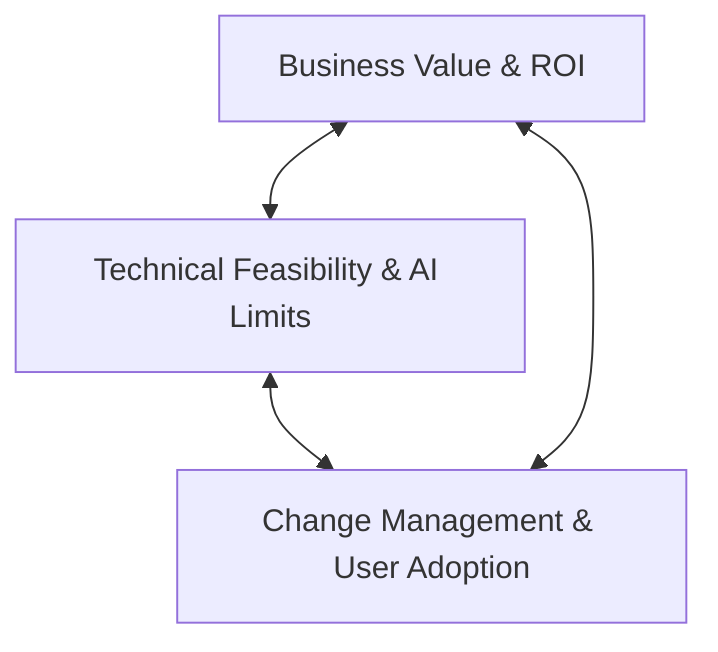
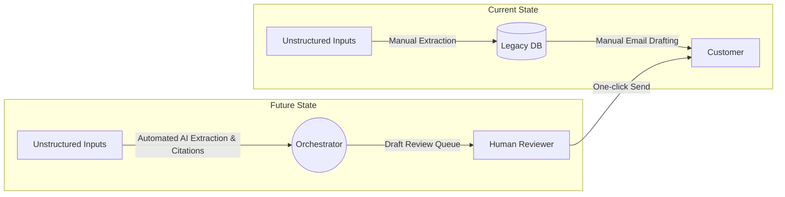
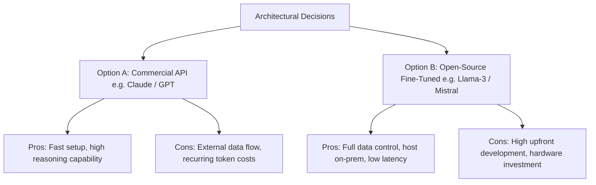
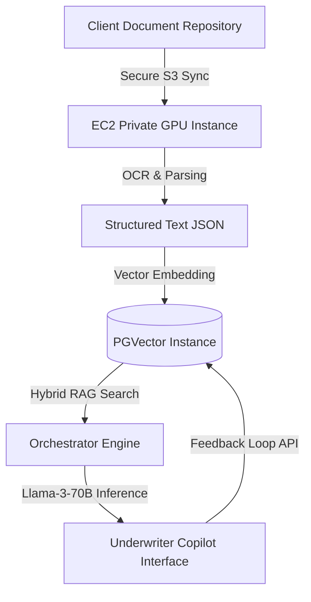
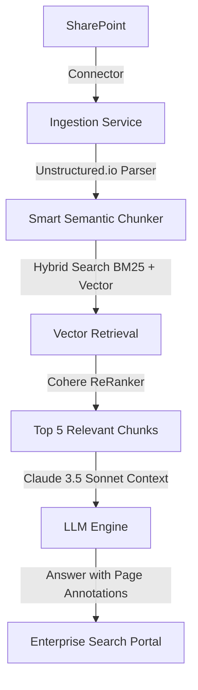
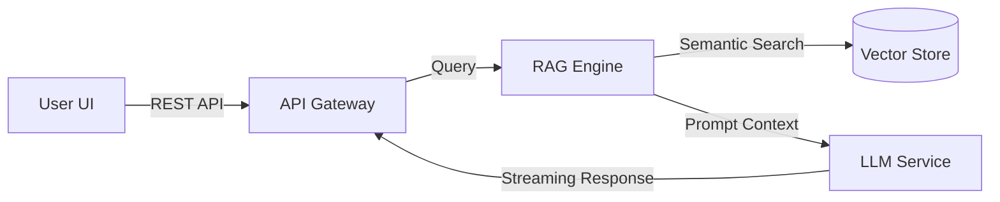

# AI Forward Deployed Engineer (AI FDE) Fundamentals: Master Curriculum


This document serves as the comprehensive master reference manual for learning AI Forward Deployed Engineering, taking you from beginner concepts to production, enterprise-grade deployment, and customer-facing delivery.

---

# Phase 1: AI FDE Fundamentals

---

## Module 1: What is an AI Forward Deployed Engineer (AI FDE)?

### 1. Detailed Theory & Taxonomy
The **AI Forward Deployed Engineer (AI FDE)** is a highly specialized engineering role operating at the intersection of enterprise software engineering, artificial intelligence, technical consulting, and product management. Originating from companies like Palantir, C3.ai, and Scale AI, the "Forward Deployed" model places engineers directly on the front lines of customer environments to design, build, integrate, and deploy custom solutions using the core technology stack.

#### Career Matrix Comparison:
| Dimension | Software Engineer (SWE) | AI Engineer (AIE) | Solutions Architect (SA) | AI FDE | Product Manager (PM) |
| :--- | :--- | :--- | :--- | :--- | :--- |
| **Primary Focus** | Scalability, code quality, and core product features. | Model optimization, RAG, and agentic workflows. | High-level system design, pre-sales architecture diagrams. | **Customer business outcomes, end-to-end integration, custom AI deployment.** | Feature prioritization, roadmap ownership, user research. |
| **Customer Interface** | Low (Internal only) | Medium (Internal engineering) | High (Pre-sales & scoping) | **Extremely High (Co-located, day-to-day partner)** | Medium to High (Feedback, discovery) |
| **Coding Depth** | High (System level) | High (Model & application level) | Low (POCs, slide decks, diagrams) | **High (Integration glue, custom pipelines, agent architectures)** | Low (Pseudocode, SQL, specs) |
| **Business Strategy** | Low to Medium | Medium | High | **Extremely High (ROI definition, process mapping)** | High |

#### Career Progression Path:
1. **Associate AI FDE (Beginner):** Focuses on building integration pipelines, executing templates, and supporting discovery workshops.
2. **AI FDE II (Intermediate):** Owns small-to-medium customer engagements, designs RAG architectures, and leads technical client interactions.
3. **Senior AI FDE (Advanced):** Architect of complex, multi-system enterprise AI integrations; leads business value mapping and handles executive technical objections.
4. **Principal AI FDE / solutions Director (Enterprise):** Shapes core product feedback loop, designs repeatable industry-specific vertical blueprints, and negotiates delivery scope with Fortune 500 CxOs.

---

### 2. Real Business Examples & Enterprise Use Cases
*   **Scale AI FDEs** embedded with defense agencies to curate data pipelines, build custom model evaluation criteria, and deploy secure computer vision pipelines in disconnected environments.
*   **Palantir FDEs** deployed to global logistics giants (e.g., DHL) to ingest ERP data, orchestrate ontology models, and build operational decision tables.
*   **Enterprise AI Advisory Case:** An FDE embedded at a retail bank to replace a rigid, rule-based customer onboarding workflow with an agentic KYC (Know Your Customer) pipeline, reducing processing time from 4 days to 4 minutes.

---

### 3. Frameworks & Methodologies
#### The FDE Value Triad
An AI FDE must balance three distinct dimensions to deliver successful implementations:

*   **Technical Feasibility:** Can this model solve the problem with >=95% accuracy? What is the latency and cost footprint?
*   **Business Value:** Does solving this problem save $10M+ in operational expenses or drive new revenue?
*   **Change Management:** Will the actual operations teams trust and use the AI output, or will they bypass it?

---

### 4. Step-by-Step Learning Progression
*   **Beginner Level:** Understand what makes AI FDE distinct. Learn to speak the language of business (ROI, KPIs, CAPEX/OPEX) and basic architecture.
*   **Intermediate Level:** Master the trade-offs between API-based LLMs vs. fine-tuned open-source models; learn how to run a discovery call.
*   **Advanced Level:** Build production-grade RAG and agentic workflows inside client networks. Tackle enterprise network security policies.
*   **Enterprise Level:** Design governance, compliance (GDPR, EU AI Act), data privacy boundaries, and multi-tenant security layers.
*   **AI FDE Level:** Combine high-level product design, enterprise security architecture, and senior stakeholder relationship management.

---

### 5. Checklists & Templates
#### Pre-Engagement Client Readiness Checklist
- [ ] **Data Access:** Are client data sources identified and accessible? Has the NDA and Security Review been completed?
- [ ] **Executive Sponsor:** Is there an active business sponsor who owns the budget and is accountable for adoption?
- [ ] **Infrastructure Strategy:** Is the deployment cloud-hosted (AWS, Azure, GCP), hybrid, or fully on-prem/air-gapped?
- [ ] **Success Definition:** Are the target metrics (e.g., 30% speedup, 15% cost reduction) agreed upon and baseline data collected?

---

### 6. Discovery Questions & Customer Conversations
*   *FDE:* "To make sure we build the right system, what is the manual process step that consumes the most time for your analysts today?"
*   *Customer:* "They manually read 50-page PDF policy documents to see if a claim matches the exclusions."
*   *FDE:* "Understood. If we can accurately extract those exclusions and flag matches with reference citations, how would that impact their daily throughput, and what is the current error rate?"

---

### 7. Interview Questions & Common Mistakes
*   **Interview Question:** "A client has their data in an on-premises Oracle database with strict firewall rules and wants you to build a GPT-4 powered reasoning assistant. How do you approach this?"
*   **Common Mistake:** Proposing to export database records via CSV over email or suggesting a public API connection directly to OpenAI without a secure VPC/ExpressRoute tunnel or a locally hosted open-source model (e.g., Llama-3-70B on internal GPUs).

---

### 8. End-to-End Delivery Scenario
An FDE is deployed to an energy enterprise to build a predictive maintenance advisor. The FDE coordinates with safety engineers (users), database administrators (data owners), and the VP of Operations (sponsor). By deploying an agentic search engine over equipment manuals and sensor logs, the FDE reduces equipment downtime by 12% in the first pilot site.

---

## Module 2: AI FDE Role Overview & Customer Lifecycle

### 1. Detailed Theory
The lifecycle of an FDE engagement mirrors the enterprise software delivery lifecycle but with added feedback loops unique to generative AI and unstructured data.

```
[Technical Discovery] ➔ [Solution Architecture] ➔ [MVP Pilot Build] ➔ [Integration & Hardening] ➔ [Adoption & Scale]
```

#### Daily, Weekly, and Monthly Activities of an FDE:
*   **Daily:** Co-locate with client developers/data scientists, debug pipeline integrations, pair-program on prompt engineering/guardrails, and sync with business users to test model outputs.
*   **Weekly:** Conduct sprint reviews with the client steering committee, track data ingestion metrics, and run model evaluation audits (evals) against baseline datasets.
*   **Monthly:** Present MVP performance and ROI metrics to the VP/C-level sponsors; map out scaling strategies and platform upgrades.

---

### 2. Real Business Examples
*   **Engagement Lifecycle at a Global Insurer:**
    1. *Discovery (Weeks 1-2):* Shadow claims handlers to document decision-making steps.
    2. *Solution Design (Week 3):* Design a pipeline that ingests claims PDFs, runs OCR, extracts metadata, and compares them with policies using a RAG architecture.
    3. *MVP Pilot (Weeks 4-6):* Deploy the tool to 10 users. Monitor accuracy and tweak prompts based on user feedback.
    4. *Scale (Weeks 7+):* Integrate with Guidewire (core system) and roll out to 500 handlers.

---

### 3. Methodologies: The 3-Tier Stakeholder Map
An FDE must communicate differently across three organizational tiers:
1.  **Technical Leads (Data/Security/Infra):** Talk APIs, data schemas, IAM roles, latency, and VPC peering.
2.  **Business Users (Operations/Underwriters/Agents):** Talk UI/UX, accuracy, speed, workflows, and ease of use.
3.  **Executive Sponsors (CxOs/VPs):** Talk ROI, dollar savings, risk reduction, timeline, and strategic positioning.

---

### 4. Checklists & Templates
#### Stakeholder Alignment Interview Template
*   **Objective:** Define the business user's pain points.
*   **Questions:**
    *   What are the top 3 inputs you need to make this decision?
    *   Where does this data live?
    *   What is a "bad" output from our system that would make you lose trust in it?

---

### 5. Interview Questions & Common Mistakes
*   **Interview Question:** "The client's security officer halts your deployment because they are worried about LLM training data leaks. How do you resolve this?"
*   **Common Mistake:** Saying, "Don't worry, the API terms of service say they don't train on your data." You must provide the formal data processing agreements (DPA), show architecture diagrams of zero-data-retention endpoints, or demonstrate a private instance deployment in their own Azure/AWS tenant.

---

## Module 3: AI FDE Responsibilities

### 1. Business Responsibilities: Value Mapping & ROI Analysis
Every AI initiative must tie directly to one of three levers:
1.  **Revenue Growth:** Increasing conversion rates, recommending high-value actions.
2.  **Cost Reduction:** Decreasing handle times, automating repetitive document processing.
3.  **Risk Mitigation:** Preventing compliance errors, flagging fraud patterns early.

#### The Value Mapping Framework:
```
Business Objective (e.g., Reduce Customer Churn)
   └── Sub-Driver (Reduce response time to complaints)
        └── Technical Solution (Deploy agentic routing & draft generation)
             └── Metric (Decrease response SLA from 2 hours to 5 minutes)
```

---

### 2. Technical Responsibilities: Data Strategy & AI System Design
*   **Data Quality Assessment:** Checking if client data has high entropy, missing schemas, or inconsistent formats.
*   **Latency & Cost Budgeting:** Selecting the right model size. For example, using a smaller, faster model (e.g., Llama-3-8B) for initial text extraction and a larger model (e.g., Claude 3.5 Sonnet) for final synthesis.
*   **Enterprise Integration:** Designing secure patterns to feed AI outputs back into core transaction databases (ERP, CRM) via message queues (Kafka, RabbitMQ) or REST APIs.

---

### 3. Delivery Responsibilities: MVP Planning & Success Metrics
*   **Define the MVP (Minimum Viable Product):** Focus on the minimum set of features that can prove business value and capture user feedback.
*   **Track Critical Metrics:**
    *   *System Metrics:* Latency, Token Cost, P99 Response Time, Eval Score.
    *   *Product Metrics:* Daily Active Users (DAU), System Usability Score (SUS), Thumbs Up/Down ratio.
    *   *Business Metrics:* Average Handle Time (AHT) reduction, Error Rate drop.

---

### 4. Discovery Questions
*   "What is your target cost per transaction?"
*   "What data sources are completely off-limits due to compliance or customer privacy regulations?"
*   "How does the target system handle failures today? What is the manual backup process?"

---

### 5. Real Customer Scenario
A logistics client wanted to run an LLM over invoice images to verify billing codes. The FDE realized that the invoice images were low-resolution scans, leading to poor OCR accuracy. Instead of fine-tuning a larger LLM, the FDE restructured the data strategy: first, clean up the scans using an specialized image pre-processing model, then run OCR, and finally use a smaller LLM to categorize the extracted clean text.

---

## Module 4: The AI FDE Mindset

### 1. Detailed Theory
An FDE differs from a classic software engineer in their relationship to ambiguity, ownership, and user behavior.

```
SWE Mindset: "The specification says X. I wrote code that matches X. My job is done."
FDE Mindset: "The business needs to solve Y. The specification says X, but X doesn't solve Y. I must change the system design to solve Y."
```

#### Core Mindset Pillars:
*   **First Principles Thinking:** Stripping a problem down to its fundamental truths. Instead of asking, "How do we build a better chatbot?" ask, "Why do users call the helpdesk in the first place, and can we automate that step directly?"
*   **Customer Obsession:** Understanding the user's emotional and operational context. If a call center agent has 3 screens open, they won't use a chatbot that requires a 4th screen. The FDE integrates the assistant directly into the existing CRM window.
*   **Outcome-Oriented:** Measuring success by operational change (e.g., "90% of claims are now processed in 24 hours") rather than code deployments (e.g., "V2 of the API is live").

---

### 2. Decision-Making Framework: Build vs. Buy vs. Configure
When faced with an enterprise AI requirement, an FDE evaluates options using a structured matrix:

| Option | Speed to Value | Customization | Maintenance Burden | Data Security |
| :--- | :--- | :--- | :--- | :--- |
| **Buy (SaaS / Out-of-the-Box)** | Fast (Days) | Low | Low | Medium (Third-party data flow) |
| **Build (Custom model/infra)** | Slow (Months) | High | Very High | Excellent (Self-hosted) |
| **Configure (FDE Model - Core Platform + Custom Connectors)** | **Medium (Weeks)** | **High** | **Medium (Shared responsibility)** | **Excellent (Hybrid/VPC)** |

---

### 3. Interview Questions & Common Mistakes
*   **Interview Question:** "The client asks you to build an AI system that generates marketing copy, but you notice their content library is disorganized and contains outdated branding. What do you do?"
*   **Common Mistake:** Going ahead and building the generator anyway, leading to outputs that run contrary to current brand guidelines. The FDE should first structure a preprocessing step that filters out old files and applies a brand-verification guardrail step before returning the output to users.

---

## Module 5: Customer-Facing Engineering & Workshops

### 1. Discovery Meetings and Technical Workshops
An FDE must run structured workshops that bridge the gap between technical teams and business sponsors.

#### The Discovery Workshop Agenda Structure:
```
Session 1: Problem Deep-Dive (Business) ➔ Session 2: Data & Systems Mapping (Technical) ➔ Session 3: MVP Scoping & Roadmap (Combined)
```

---

### 2. Framework: Requirement Elicitation via "Day in the Life" (DITL)
To understand what to build, shadow a client operator for a full business day. Document:
*   Every click they make.
*   Every application they switch to.
*   Where they experience delay or cognitive overload.
*   Decisions requiring human judgment vs. repetitive rules.

---

### 3. Template: Client Alignment Deck Outline
*   **Slide 1:** Exec Summary (The business challenge and the target AI impact).
*   **Slide 2:** Current Workflow Architecture vs. Proposed AI-Augmented Workflow.
*   **Slide 3:** Data Requirements & Security Plan (Where data flows, VPC boundaries).
*   **Slide 4:** Success Metrics & MVP Timeline (6-week target roadmap).

---

### 4. Practice: Customer Conversation (Objection Handling)
*   **Client CTO:** "We are worried that using LLMs will lead to hallucinated facts in our customer correspondence."
*   **FDE Response:** "That's a valid concern. We address this through a three-layered defense: first, we restrict the model's context to verified product manuals using semantic search (RAG); second, we run automated validation checks to verify that every claim in the response matches a reference source; and third, we keep a human expert in the loop to review and approve the draft before it goes to the customer."

---

## Module 6: Technical Consulting & Business Analysis

### 1. Consulting Frameworks
An FDE leverages consulting frameworks to dissect enterprise operations and structure recommended changes.

#### Five Whys Framework (Root Cause Analysis Example):
*   *Problem:* The customer service team's response time is too high.
    *   *Why?* Operators spend too long typing out replies.
    *   *Why?* They must search through multiple legacy systems for product details.
    *   *Why?* The product details are stored across 12 different PDFs and databases.
    *   *Why?* There is no central lookup system.
    *   *Why?* It was never integrated.
*   *Solution:* Instead of training agents on writing speed, build a unified semantic search tool that finds the answer across the 12 documents and drafts the response.

#### Value Stream Mapping:
Analyze the flow of information and materials. Map time-to-value:
```
[Ingest Document (5 min)] ➔ [Manual Data Entry (30 min)] ➔ [Manager Review (2 hours)] ➔ [System Upload (10 min)]
```
Identify that the "Manager Review" queue is the actual bottleneck. Focus the AI solution on speeding up the review process via risk-flagging rather than just accelerating the data entry step.

---

### 2. Consulting Playbook: Current State vs. Future State Target


---

## Module 7: Business-First Thinking & ROI Engineering

### 1. Detailed Theory
Enterprise leaders do not buy AI models; they buy **operational outcomes**. If an FDE cannot explain the ROI in dollar terms, the project will be classified as an R&D experiment and eventually canceled.

#### Key Business Metrics:
*   **OPEX (Operating Expense) Reduction:** Saving time/labor.
*   **FTE (Full-Time Equivalent) Reallocation:** Redirecting staff from data entry to high-value tasks.
*   **AHT (Average Handle Time):** Speed of customer interaction.
*   **CSAT / NPS:** Customer satisfaction and loyalty.

---

### 2. The ROI Calculation Framework
Suppose a bank receives **100,000 credit applications** per year.
*   Each application takes an analyst **45 minutes** to review.
*   The fully loaded cost of an analyst is **$40/hour**.
*   *Baseline Cost:* $100,000 \times 0.75 \text{ hours} \times \$40 = \$3,000,000 / \text{year}$.
*   *AI Target System:* Automation extracts applicant details and screens for compliance rules with 90% accuracy, reducing review time to **15 minutes** for the analyst.
*   *New Cost:* $(10,000 \times 0.75 \text{ hours} \times \$40) + (90,000 \times 0.25 \text{ hours} \times \$40) = \$300,000 + \$900,000 = \$1,200,000$.
*   *Gross Savings:* **$1.8 Million / year**.
*   *System Cost:* $300,000 (Setup) + $100,000 (Annual licenses + API costs).
*   *First Year ROI:* **$1.4 Million net savings**.

---

### 3. Checklists & Templates
#### Business KPI Dashboard Metric Mapping
- [ ] Metric 1: Baseline Value vs. Target Pilot Value.
- [ ] Metric 2: Daily Volume of Transactions Run through the AI System.
- [ ] Metric 3: Percentage of AI Outputs Accepted by human agents without edits.
- [ ] Metric 4: Direct API & Infrastructure Costs incurred per run.

---

## Module 8: Product Thinking & User Experience

### 1. Product Frameworks for AI Applications
*   **Jobs to Be Done (JTBD):** "When I am reviewing an insurance claim, I want to quickly identify if the applicant has prior related claims, so that I can make a fair and accurate decision without browsing through five legacy database tabs."
*   **RICE Prioritization for Features:**
    $$\text{Score} = \frac{\text{Reach} \times \text{Impact} \times \text{Confidence}}{\text{Effort}}$$
    Use this to decide whether to build a complex custom workflow editor vs. a simple copy-to-clipboard chat interface first.

---

### 2. User Journey Mapping: AI Feedback Loop
To build trust, the UI must allow the user to easily correct the model and submit feedback. This feedback must be fed back into the evaluation dataset.

```
AI Suggests Extraction ➔ User Reviews ➔ User Edits Output (Diff Captured) ➔ Click Approve ➔ Save Data to Database & Log Diff to Eval Dataset
```

---

### 3. Enterprise Product Requirement Example
*   **Feature:** Citation Tooltips.
*   **Requirement:** Any data point extracted by the LLM from a source PDF must display a highlight over the original document on hover, allowing the user to visually verify the source text instantly.

---

## Module 9: Problem-Solving Frameworks

### 1. MECE (Mutually Exclusive, Collectively Exhaustive)
When diagnosing why an AI project is underperforming, use a MECE tree to categorize potential issues:
```
Model Performance Issue
 ├── Data Layer Issues (Incomplete sources, low OCR accuracy, stale vector index)
 └── Model Logic Issues (Poor system prompts, out-of-context documents, token limit truncation)
```

---

### 2. Trade-Off Analysis Framework
Evaluating system architecture alternatives:



---

### 3. Fishbone (Ishikawa) Diagram for AI Accuracy Drops
*   **People:** Lack of training, users inputting poor query prompts.
*   **Process:** Stale database records, lack of feedback collection mechanisms.
*   **Technology:** Model temperature set too high, vector search top-k cutoff too low.
*   **Data:** Poor PDF scanning, lack of structure in source documents.

---

## Module 10: AI Solution Delivery Fundamentals

### Phase-by-Phase Execution Methodology

```
   DISCOVERY                DESIGN                  BUILD                 DEPLOY                MEASURE
┌──────────────┐        ┌──────────────┐        ┌─────────────┐        ┌─────────────┐        ┌──────────────┐
│• Run DITL    │        │• System Arch │        │• Pipeline   │        │• Pilot Group│        │• Track AHT   │
│• Check Data  │───────>│• Define Evals│───────>│• RAG Setup  │───────>│• Feedback   │───────>│• ROI Audit   │
│• Align KPIs  │        │• UX Wireframe│        │• Iterative  │        │  Log Loops  │        │• Scale Roll  │
└──────────────┘        └──────────────┘        └─────────────┘        └─────────────┘        └──────────────┘
```

#### Detailed Phase Tasks:
1.  **Discovery Phase:**
    *   Conduct technical and data discovery.
    *   Verify API limits, data schemas, compliance bounds, and GPU availability.
2.  **Design Phase:**
    *   Map the integration endpoints (APIs, webhooks, databases).
    *   Define the evaluation metrics (e.g., Rouge, BLEU, or LLM-as-a-Judge grading rubrics).
3.  **Build Phase (Iterative):**
    *   Set up data pipelines, structure the vector store, write model orchestration code.
    *   Implement user feedback loops (thumbs up/down with text boxes).
4.  **Deploy Phase:**
    *   Launch to a small pilot user cohort (10-20% of team).
    *   Conduct user training sessions focusing on how to spot hallucinations and write good prompts.
5.  **Measure Phase:**
    *   Compare pilot performance against the historical baseline.
    *   Compile the ROI report and plan full rollout.

---

# Enterprise AI FDE Case Studies

---

## Case Study 1: Insurance Underwriting Copilot

### 1. Problem Discovery & Process Mapping
*   **Client Context:** A commercial property insurer.
*   **The Problem:** Underwriters spend hours reading engineering reports, inspection logs, and historical claim documents to assess the risk of a commercial building.
*   **Current State Workflow:**
    ```
    Receive PDFs ➔ Extract building details manually into Excel ➔ Apply rules ➔ Write risk summary report
    ```

---

### 2. Stakeholder Mapping & Discovery Questions
*   **Sponsor:** Head of Underwriting (wants to double underwriting throughput without adding headcount).
*   **Users:** Underwriters (fear that AI will miss critical structural risks or automate away their roles).
*   **IT Lead:** Enterprise Architect (strictly against cloud data uploads).

#### Key Discovery Questions:
*   *To Underwriters:* "What is the most common reason you reject a risk that isn't immediately obvious on page one of a report?"
*   *To IT Lead:* "If we use a private deployment of an LLM within your AWS VPC, what security certificates or network egress policies must we adhere to?"

---

### 3. AI Solution Design & Architecture


#### Critical Guardrail Design:
Every risk recommendation must include a clickable link to the exact page and paragraph in the source engineering report where the data point was found.

---

### 4. Success Metrics & ROI Realized
*   **AHT Reduction:** Average time to analyze a risk reduced from **3 hours to 45 minutes** (75% reduction).
*   **Underwriter Confidence Score:** 92% of underwriters reported high trust in the system due to the citation tooltips.
*   **Financial Impact:** Increased underwriting capacity led to a **$12M increase in written premiums** within the first 6 months.

---

## Case Study 2: Customer Support AI Assistant

### 1. Problem Discovery
*   **Client Context:** A telecommunications enterprise handling 500,000 customer inquiries per month.
*   **The Problem:** Support agents spend excessive time looking up troubleshooting steps in separate knowledge bases, resulting in long call queues.

---

### 2. Requirement Elicitation
*   **Requirement:** The assistant must suggest real-time replies that are compliant with consumer protection laws.
*   **System Constraint:** Call center systems require response times of **less than 1.5 seconds** to prevent conversational delay.

---

### 3. AI Architecture Decisions
To solve the latency constraint, a two-step process was implemented:
1.  **Fast Path (Routing & Retrieval):** A smaller model (e.g., Llama-3-8B) runs semantic search and categorizes the customer intent instantly.
2.  **Synthesis Path (Drafting):** A streaming API returns the suggested answer letter-by-letter, allowing the agent to read the response as it is generated rather than waiting for the entire block to complete.

---

### 4. Deployment Strategy
*   **Week 1-2:** Pilot with 20 agents using a standalone UI.
*   **Week 3:** Refine retrieval logic based on agent edits.
*   **Week 4:** Integrate directly into the existing CRM UI as an iframe widget.
*   **Week 5+:** Roll out to 1,000 agents.

---

## Case Study 3: Enterprise Knowledge Assistant (RAG)

### 1. The Challenge
A global energy enterprise has millions of research documents, drilling logs, and compliance records stored in SharePoint folders. Employees spend hours searching for historical drilling data before starting new projects.

---

### 2. Advanced RAG Design Pattern
To handle the scale and variety of documents (PDFs, TIFFs, Excel files, PowerPoint decks), the FDE designed an advanced RAG pipeline:



---

### 3. User Adoption & Measuring ROI
*   **Adoption Strategy:** Champion programs where top users in each department are trained as power users to run weekly demo sessions.
*   **ROI Measurement:** Tracked hours saved on research tasks, translating to a saving of **$4.2M in engineering hours annually**.

---

## Case Study 4: Claims Processing Automation

### 1. Business Process Mapping
Automating auto insurance claims processing by mapping the current sequence:
```
Accident Report ➔ Police Report Upload ➔ Damage Photos ➔ Adjuster Estimation ➔ Payment Approval
```

---

### 2. AI Workflow Design
The system uses a combination of multimodal models and structured agents:
*   **Agent 1 (Multimodal Vision):** Analyzes photos of the vehicle damage to estimate repair costs based on standard pricing tables.
*   **Agent 2 (Text Extractor):** Extracts driver statements from the police report.
*   **Agent 3 (Reasoning & Fraud Flagging):** Compares Agent 1's estimate and Agent 2's narrative with the policy rules to flag discrepancies.

---

### 3. Outcome Measurement
*   **Straight-Through Processing (STP) Rate:** 65% of simple claims (<$2,000) processed automatically without human intervention.
*   **Cycle Time:** Reduced average claim resolution time from **7 days to 4 hours**.

---

## Case Study 5: Sales Intelligence Copilot

### 1. Product Thinking & Opportunity Assessment
*   **Goal:** Provide sales representatives with real-time customer intelligence during prep calls.
*   **Feature Set:** Auto-generate summary cards containing the client's recent press releases, financial reports, and current product suite.

---

### 2. User Journey Mapping
```
Calendar Event Trigger ➔ Background Worker Runs ➔ Fetch CRM Account Info ➔ Fetch Recent News ➔ Generate Briefing Card ➔ Push to Rep's Mobile App 15 min before meeting
```

---

### 3. Business KPIs
*   **Conversion Rate:** 14% increase in sales opportunity conversion.
*   **Time Spent on Prep:** Reduced manual sales prep time by **4.5 hours per week per representative**.

---

# AI FDE Deliverables & Templates

Here is how to create, format, and execute key deliverables for enterprise projects.

---

## 1. Discovery Document (DD)

### Purpose:
Documenting the technical and operational status of a client's organization before proposing a solution.

### Template:
```markdown
# Technical Discovery Document: Project [Name]

## 1. Executive Summary
*   **Target Opportunity:** [Summarize the problem and the anticipated business impact]
*   **Sponsor Team:** [Business Sponsor, Technical Champion]

## 2. Current State Assessment
*   **System Overview:** [Describe the legacy systems and data stores currently used]
*   **Data Profile:** [Format, Volume, Velocity, and Access Protocols]
*   **Operational Flow:** [Step-by-step description of current human actions]

## 3. Constraints & Dependencies
*   **Security & Compliance:** [VPC, Data Sovereignty, PII Masking, Regulations]
*   **Infrastructure Constraints:** [Cloud restrictions, API limits, GPU access]

## 4. Key Risks
*   [Risk 1: E.g., Lack of labeled training data for evaluations]
*   [Risk 2: E.g., High network latency on internal database queries]
```

---

## 2. Business Requirement Document (BRD)

### Purpose:
Defining what the business expects the AI system to accomplish.

### Template:
```markdown
# Business Requirement Document (BRD): [System Name]

## 1. Project Objectives
*   Primary Goal: Reduce Average Handle Time of customer emails by 40% while keeping CSAT above 90%.

## 2. Functional Requirements
*   **Req 1:** The system must generate drafts that correspond to the category of customer inquiry.
*   **Req 2:** The system must allow agents to edit the draft before sending it to customers.
*   **Req 3:** The system must log agent modifications to evaluate performance.

## 3. Non-Functional Requirements
*   **Accuracy:** System must reach 95% classification accuracy.
*   **Latency:** Draft generation must complete in under 2 seconds.
*   **Availability:** Operational during business hours (9 AM - 6 PM EST) with 99.5% uptime.

## 4. Success Criteria & Impact Metrics
| Metric | Baseline | Target (Pilot) | Measurement Method |
| :--- | :--- | :--- | :--- |
| Email Handle Time | 8.5 minutes | 5.0 minutes | CRM Ticket Logs |
| CSAT Score | 88% | >90% | Post-interaction Survey |
```

---

## 3. Solution Design Document (SDD)

### Purpose:
Providing the blueprint of the technical implementation.

### Template:
```markdown
# Solution Design Document (SDD): [System Name]

## 1. System Architecture


## 2. Integration Specifications
*   **Input Endpoints:** `/api/v1/generate-draft` (POST)
*   **Payload Schema:**
```json
{
  "ticket_id": "12345",
  "customer_query": "How do I return my order?",
  "account_type": "Premium"
}
```

## 3. Model & Retrieval Config
*   **LLM Model:** Claude 3.5 Sonnet (API deployed in client Azure Tenant)
*   **Embedding Model:** text-embedding-3-large
*   **Vector Database:** pgvector on AWS RDS PostgreSQL
*   **Retrieval Strategy:** Hybrid search (top-k=5, reranked via Cohere ReRanker)

## 4. Security & Compliance Strategy
*   **Data Encryption:** TLS 1.3 in-transit, AES-256 at-rest.
*   **Data Masking:** PII scrubbing service runs before data is sent to the LLM.
*   **Auditing:** System logs every LLM request and raw output to a secure cloud bucket.
```

---

## 4. ROI & Performance Review Report

### Purpose:
Demonstrating the value realized at the end of the pilot.

### Template:
```markdown
# ROI & Performance Review Report: [Project Name] Pilot Phase

## 1. Pilot Summary
*   **Duration:** [Start Date] to [End Date]
*   **User Group Size:** [Number] of operators
*   **Total Transactions Processed:** [Number] of transactions

## 2. Target Performance vs. Actual Results
| Performance Indicator | Baseline | Pilot Target | Actual Result | Status |
| :--- | :--- | :--- | :--- | :--- |
| Processing Time | 12 min | <8 min | 6.5 min | **Exceeded** |
| User Acceptance Rate | N/A | >80% | 86% | **Met** |
| System Hallucination Rate | N/A | <2% | 0.8% | **Met** |

## 3. Financial Analysis
*   **Monthly Savings Achieved:** $[Amount]
*   **Projected Annual Savings (Full Rollout):** $[Amount]
*   **Break-Even Horizon:** [Number] months from deployment

## 4. Key Learnings & Recommendations
*   *Learning 1:* Users frequently edited standard signature blocks; recommendation is to pre-populate signatures outside the LLM workflow.
*   *Learning 2:* Vector database retrieval accuracy dropped for query terms containing specific abbreviations; recommendation is to add an abbreviation mapping lookup.
```

---

# Mastering the AI FDE Career: Core Playbook

To succeed as an AI Forward Deployed Engineer:
1.  **Prioritize Business Value First:** Never lead a conversation with the model name or architecture. Lead with the business metric you are improving.
2.  **Code with the Enterprise in Mind:** Assume data is dirty, networks are restricted, and users are skeptical. Build safety and feedback into every pipeline.
3.  **Drive Change, Not Just Code:** A highly accurate model is useless if users refuse to run it. Spend time co-locating with your users to build tools they trust.
