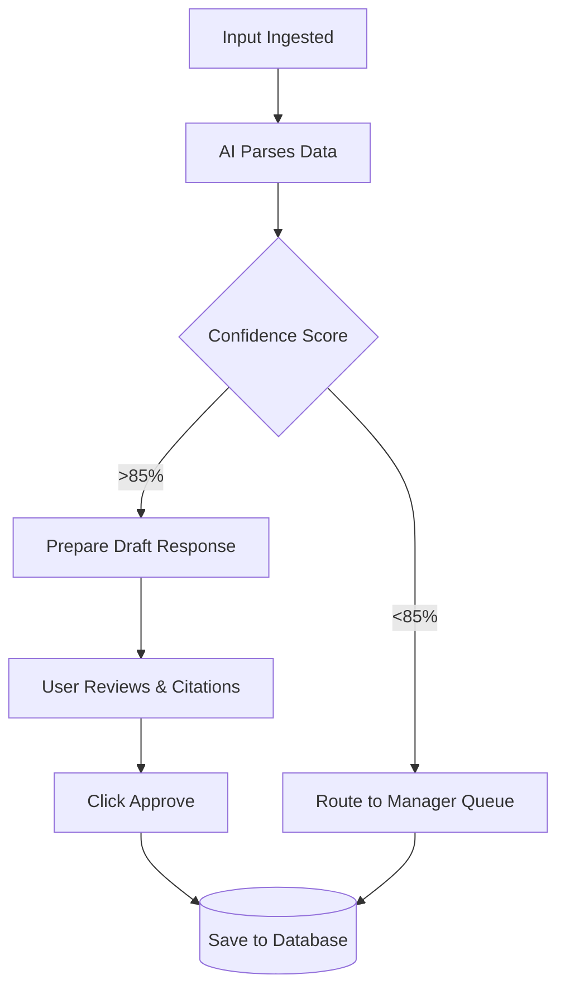
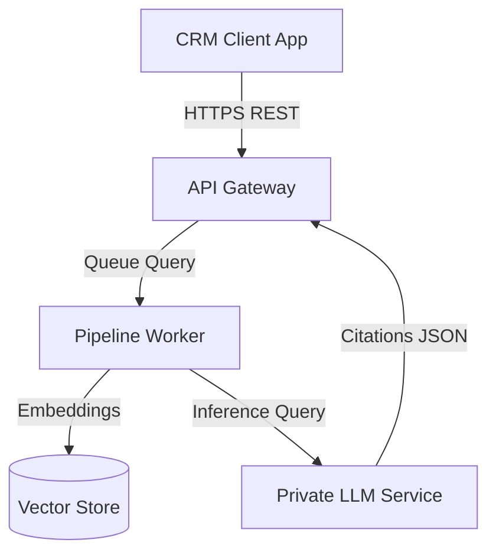
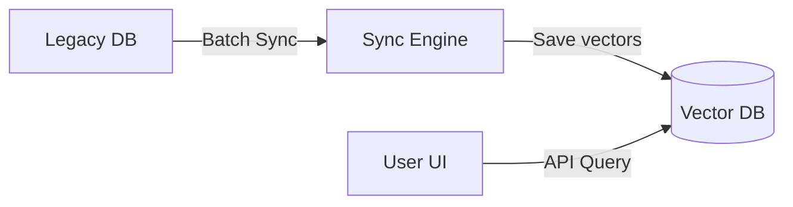

# AI Forward Deployed Engineer (AI FDE) Fundamentals: Solution Design


This document serves as the comprehensive master reference manual for **Phase 6: Solution Design**, taking you from beginner concepts to enterprise-grade execution in solution discovery, functional modeling, non-functional requirements (NFRs), workflow integration, user experience design, scalability planning, high-availability setups, zero-trust security architectures, and technical documentation.

---

# Phase 6: Solution Design

---

## Module 1: Solution Discovery

### 1. Detailed Theory & Taxonomy
Solution Discovery is the process of translating business requirements, identified pain points, and process maps into a concrete technical architecture. It bridges the gap between *what* the business needs and *how* the technology will execute it, ensuring problem-solution fit before writing code.

```
BUSINESS REQUIREMENT ➔ TECHNICAL SPECIFICATION ➔ SYSTEM BLUEPRINT ➔ PROTOTYPE VALIDATION
```

#### Key Discovery Elements:
*   **Problem-Solution Mapping:** Verifying that the proposed AI components (e.g., semantic search, parsing models) address the root causes of business friction.
*   **Solution Scope Definition:** Specifying system boundaries, data inputs, APIs, and operational constraints to prevent scope creep.
*   **Outcome Mapping:** Linking technical outcomes (e.g., latency, extraction accuracy) directly to business outcomes (e.g., handle time reduction).

---

### 2. Enterprise Framework: The Solution Discovery Canvas
```
+---------------------------------------------------------------------------------------+
| 1. Target Problem & Root Cause                                                        |
| [State the business problem and its root causes as verified in Phase 4]               |
+---------------------------------------+-----------------------------------------------+
| 2. Proposed AI Solution               | 3. Data & API Dependencies                    |
| [Describe the RAG, parsing, or agent  | [List target database schemas, endpoints,     |
|  models required]                     |  and access permissions]                      |
+---------------------------------------+-----------------------------------------------+
| 4. System Boundaries                  | 5. Core Success Metric                        |
| [What the system will NOT do]          | [Quantifiable threshold, e.g., AHT <5 min]    |
+---------------------------------------+-----------------------------------------------+
```

---

### 3. Checklists & Templates
#### Solution Discovery Checklist
- [ ] Verify that the proposed solution maps directly to a business driver.
- [ ] Confirm that all database owners have agreed to provide read/write API access.
- [ ] Define the system boundaries and document what is out of scope.
- [ ] Run a preliminary data quality check to verify readability of input documents.

---

## Module 2: Functional Design

### 1. Detailed Theory
Functional Design defines the capabilities, features, and workflows of the software system from the user's perspective, mapping out user stories and acceptance criteria.

#### Functional Artifacts:
*   **Capability Map:** Categorizing the high-level business capabilities the system enables (e.g., ingestion, extraction, validation, reporting).
*   **Feature Map:** Breaking capabilities down into specific software features (e.g., OCR engine, citation tooltips, feedback buttons).
*   **User Story Mapping:** Arranging user stories along a grid to map out the user's journey, helping prioritize release backlogs.

---

### 2. Enterprise Framework: The Feature Mapping Grid
```
+---------------------+---------------------+---------------------+---------------------+
| Capability          | Feature Name        | User Role           | Release Phase       |
+---------------------+---------------------+---------------------+---------------------+
| Data Ingestion      | Automated OCR       | System/Pipeline     | Phase 1 (MVP)       |
| Risk Analysis       | Exclusion Flagging  | Underwriter         | Phase 1 (MVP)       |
| Output Verification | Citation Highlights | Underwriter         | Phase 1 (MVP)       |
| Process Auditing    | Modification Logger | Compliance Auditor  | Phase 2 (Scale)     |
+---------------------+---------------------+---------------------+---------------------+
```

---

## Module 3: Non-Functional Design (NFRs)

### 1. Detailed Theory & Taxonomy
Non-Functional Requirements (NFRs) define system constraints and performance criteria. While functional requirements state *what* the system does, NFRs state *how well* it must do it.

#### Core NFR Dimensions:
*   **Performance & Latency:** Defining maximum response thresholds (e.g., API response times under 2 seconds) and throughput caps.
*   **Reliability & Availability:** Specifying uptime targets (SLAs) and error recovery patterns.
*   **Observability:** Establishing monitoring, logging, and alerting systems to identify issues (e.g., token limits reached or database connection errors) in real time.

---

### 2. Observability Architecture (Telemetry Pattern)
```
[User App Interface] ➔ [API Gateway Webhook] ➔ [Application Logs (ELK)] ➔ [Performance Alerts (Prometheus/Grafana)]
```

---

### 3. Checklists & Templates
#### Non-Functional Requirements Specification Template
```markdown
# Non-Functional Requirements: Claims Copilot

## 1. Latency & Performance
*   **Average Response SLA:** Model inference and citation generation must complete in under 2.5 seconds.
*   **Peak Load Capacity:** Support up to 50 concurrent active users.

## 2. Reliability & Availability
*   **Target Uptime:** 99.5% availability during core business hours (9 AM - 6 PM EST).
*   **Recovery Objective:** Mean Time to Repair (MTTR) under 1 hour.

## 3. Data Logging & Privacy
*   All user inputs and model outputs must be logged to a secure, write-only audit database.
*   No PII may be logged in plaintext formats.
```

---

## Module 4: Workflow & Process Design

### 1. Detailed Theory
Workflow Design maps the sequence of automated processes and human checkpoints within the system, detailing how data flows and how exceptions are resolved.

#### Workflow Elements:
*   **Human-in-the-Loop (HITL):** Designing checkpoints where operators review, edit, or reject AI outputs before transactions are processed.
*   **Exception Handling Flows:** Defining the path when models fall below accuracy thresholds (e.g., routing low-confidence scores to human managers).
*   **BPMN Swimlane Diagrams:** Mapping process steps across business departments and software services to show ownership clearly.

---

### 2. Enterprise Framework: Human-in-the-Loop Process Blueprint


---

## Module 5: User Experience Design (UX/UI)

### 1. Detailed Theory
AI system UX design focuses on building user trust and collaboration. FDEs design interfaces that present AI as an assistant rather than a replacement.

#### Core UX Guidelines:
*   **Actionable Citations:** Hover cards or split-screen views showing the exact source text used to generate recommendations.
*   **Confidence Scores:** Displaying visual confidence ratings (e.g., green, yellow, red status flags) to help users prioritize review steps.
*   **Inline Editing:** Allowing users to edit suggested drafts directly within the main text field, logging modifications to capture feedback data.

---

### 2. Conversational UI Layout Wireframe
```
+-----------------------------------------------------------------------------+
| System Task Header: Underwriting File #102456                               |
+--------------------------------------+--------------------------------------+
| Left Panel: Document Viewer (PDF)    | Right Panel: AI Assistant Workspace  |
|                                      |                                      |
| [Document Page: Paragraph highlighted| **AI Suggestion:**                   |
|  showing exclusion limit: $500,000]  | Exclusion limit: **$500,000** [Cite]  |
|                                      |                                      |
|                                      | Confidence Score: High (94%)         |
|                                      |                                      |
|                                      | [Accept Draft] [Edit] [Reject]       |
+--------------------------------------+--------------------------------------+
| Message / Feedback Box: [Type user corrections here...]                     |
+-----------------------------------------------------------------------------+
```

---

## Module 6: Integration Planning

### 1. Detailed Theory
Integration Planning maps the communication paths between the AI systems, databases, and enterprise applications.

#### Integration Patterns:
*   **Request/Response (REST API):** Used for real-time actions (e.g., generating a quick response during customer chats).
*   **Event-Driven (Publish/Subscribe):** Using message brokers (e.g., Kafka, RabbitMQ) to trigger processing pipelines asynchronously as files arrive.
*   **Batch Integration:** Processing data updates in scheduled runs (e.g., rebuilding vector search indices nightly).

---

### 2. Enterprise Framework: Integration Architecture Template
```
+------------------+---------------------+---------------------+---------------------+
| Source System    | Target Endpoint     | Trigger Pattern     | Data Format         |
+------------------+---------------------+---------------------+---------------------+
| Document Bucket  | Ingestion Worker    | Event (S3 Trigger)  | Binary PDF          |
| Ingestion Worker | Vector Database     | API (PostgreSQL)    | Vector Embeddings   |
| Salesforce CRM   | Model Orchestrator  | REST API Call (POST)| JSON Payload        |
+------------------+---------------------+---------------------+---------------------+
```

---

## Module 7: Scalability Planning

### 1. Detailed Theory
Scalability Planning structures how the technical architecture handles growth in user volumes, transaction counts, and data storage.

#### Scaling Dimensions:
*   **Horizontal Scaling (Scale-Out):** Adding more server nodes or containers to distribute loads (best for web APIs and pipeline workers).
*   **Vertical Scaling (Scale-Up):** Adding resources (e.g., memory, CPU, or GPU cores) to a single machine (best for hosting larger LLM models).
*   **Capacity Forecasting:** Modeling system usage targets over 12-month horizons to estimate cloud costs and prevent performance bottlenecks.

---

### 2. Checklists & Templates
#### Capacity Planning Model Worksheet
```markdown
# Capacity Estimation: Claims Copilot

## 1. Usage Projections
*   **Starting Users:** 20 active handlers.
*   **Year 1 Target:** 200 active handlers.
*   **Peak Load Target:** 50 concurrent transactions.

## 2. Infrastructure Requirements
*   **API Compute:** 3x scaled API containers (horizontal autoscale trigger >70% CPU).
*   **Vector DB Storage:** Projected 5,000,000 document chunks, requiring 40GB vector storage.
*   **GPU Footprint:** 2x Nvidia A100 GPUs for private LLM inference hosting.
```

---

## Module 8: Reliability Planning

### 1. Detailed Theory
Reliability Planning designs failover and recovery systems to ensure business continuity during outages.

#### Core Reliability Metrics:
*   **SLA (Service Level Agreement):** The commitment to the business (e.g., 99.5% uptime).
*   **SLO (Service Level Objective):** Internal team targets (e.g., 99.9% uptime).
*   **MTBF (Mean Time Between Failures):** Uptime reliability indicator.
*   **MTTR (Mean Time to Repair):** Recovery speed indicator.

---

### 2. High-Availability (HA) Failover Architecture
```
                     [Client Request]
                            │
                            ▼
                    [Load Balancer]
                 /                  \
                ▼                    ▼
     [Zone A API Container]   [Zone B API Container]
       (Primary Active)         (Secondary Hot Standby)
                \                    /
                 ▼                  ▼
               [Multi-Region Replica Vector DB]
```

---

## Module 9: Security Considerations

### 1. Detailed Theory
AI systems introduce new security vectors. FDEs implement Zero-Trust principles and Defense-in-Depth layers to protect enterprise data.

#### Security Layers:
*   **Authentication & Authorization:** System access validation using SSO and role-based permissions (RBAC).
*   **Data Masking:** Local de-identification layers to scrub PII before passing inputs to external APIs.
*   **Prompt Security:** Guardrail layers to detect and block prompt injection attempts.
*   **API Security:** Encrypting all data in transit (TLS 1.3) and at rest (AES-256).

---

### 2. Enterprise Framework: The AI Security Assessment Canvas
```markdown
# AI Security Canvas: claims Copilot

## 1. Data Protection
*   [ ] In-transit Encryption verified (TLS 1.3).
*   [ ] At-rest Encryption verified (AES-256).
*   [ ] PII scrubbing utility configured to mask names, SSNs, and phone numbers.

## 2. API & Network Security
*   [ ] System hosted within client's secure VPC network.
*   [ ] Database connections restricted to internal IP ranges.

## 3. Model Guardrails
*   [ ] Input guardrails configured to block prompt injection attempts.
*   [ ] Output guardrails configured to block unauthorized data exports.
```

---

## Module 10: Solution Documentation (SDD)

### 1. Detailed Theory
Documenting the technical architecture is key to project hand-off and long-term maintenance. FDEs author the **Solution Design Document (SDD)** to serve as the technical blueprint.

#### SDD Structure:
1.  **Architecture Overview:** High-level system blueprints and data flows.
2.  **API Specifications:** Enpoint definitions, payload schemas, and response formats.
3.  **Data Schema Designs:** Database structures, table keys, and index configurations.
4.  **Operational Guides:** Deployment steps, monitoring configs, and failover plans.

---

### 2. Solution Design Document (SDD) Template
```markdown
# Solution Design Document (SDD): Claims Copilot

## 1. System Architecture


## 2. API Endpoints
*   **Path:** `/api/v1/summarize-claim` (POST)
*   **Payload Schema:**
```json
{
  "claim_id": "890456",
  "document_s3_uri": "s3://claims-bucket/claim-890456.pdf"
}
```

## 3. Security Profile
*   System runs within private Azure VPC subnet.
*   PII scrubbed locally prior to model query.
```

---

# Enterprise AI FDE Case Studies

---

## Case Study 1: Insurance Underwriting Copilot

### 1. Functional Design
The FDE designed features enabling underwriters to highlight industrial risks, compare them against exclusions, and export draft reports to their core underwriting system.

### 2. Workflow Design
The FDE designed a swimlane workflow mapping the ingestion, extraction, and validation steps. Low-confidence extraction scores were routed to senior underwriters for manual verification.

### 3. Security & Scalability
The tool was hosted within the client's private Azure subnet to meet strict data privacy regulations, and configured with horizontal autoscaling to support 150 concurrent underwriters.

---

## Case Study 2: Claims Processing Automation

### 1. Process Design
The FDE mapped the auto-claims pipeline, using multimodal vision models to estimate repair costs from vehicle photos and comparing results with coverage rules.

### 2. Reliability & Integration
The FDE integrated the system with the Guidewire policy database using event-driven Webhooks, and implemented retry queues to process transactions during system downtime.

---

## Case Study 3: Enterprise Knowledge Assistant

### 1. User Experience Design
The FDE designed a split-screen layout for an engineering firm. The left panel displayed search recommendations, while the right panel showed the original blueprint with search matches highlighted.

### 2. Solution Discovery & Documentation
The FDE ran discovery workshops that mapped SharePoint and local shared drive data structures, compiling the results into a technical SDD for the client's IT team.

---

## Case Study 4: Customer Support AI Platform

### 1. Conversational Workflow Design
The FDE designed conversational logic for a support assistant, mapping intent classification, retrieval queries, and escalation paths to human agents.

### 2. Reliability Planning
To ensure service availability, the FDE configured multi-zone failovers for the API gateways and model clusters, keeping service downtime to a minimum.

---

## Case Study 5: Sales Intelligence Copilot

### 1. Functional Design
The FDE designed account summary pages for sales reps, integrating CRM data, recent news, and product inventories.

### 2. Adoption-Oriented UX
The FDE embedded the summary card directly within the CRM home tab, allowing reps to prepare for client calls without switching between applications.

---

# AI FDE Deliverables & Reference Guides

Here is how to create, format, and execute key solution design deliverables.

---

## 1. Non-Functional Requirement (NFR) Document

### Purpose:
Defining performance, reliability, and security constraints for the development team.

### Template:
```markdown
# Non-Functional Requirements (NFR) Specification: [Project Name]

## 1. Performance & Latency
*   Response times for real-time APIs must remain under [Number] seconds.
*   Database index queries must run in under [Number] milliseconds.

## 2. Scalability & Load
*   System must scale to support up to [Number] concurrent active sessions.
*   Database storage must support up to [Number] gigabytes of vectors.

## 3. Reliability & Recovery
*   Target system uptime is [Percentage]% SLA.
*   Failover system must trigger automatically within [Number] seconds of outage.
```

---

## 2. Integration Plan (IP)

### Purpose:
Mapping communication paths, APIs, and data schemas across internal databases and services.

### Template:
```markdown
# System Integration Plan: [Project Name]

## 1. Architecture Overview


## 2. Integration Specs
*   **System A:** [e.g., Salesforce CRM]
*   **System B:** [e.g., LLM Orchestrator Service]
*   **Communication Protocol:** [e.g., HTTPS REST API / Webhooks]
*   **Payload Schema:**
```json
{
  "request_id": "[ID]",
  "user_query": "[Query Text]"
}
```
```

---

## 3. Security Assessment Report

### Purpose:
Documenting system vulnerabilities, data boundaries, and compliance guardrails.

### Template:
```markdown
# Security Assessment: Project [Name]

## 1. Vulnerability Log
| Vector | Description | Severity | Mitigation Plan |
| :--- | :--- | :---: | :--- |
| Prompt Injection | Malicious inputs tricking model logic. | High | Implement input filtering guardrails. |
| Data Leakage | PII logs exported in API metrics. | Medium | Configure local de-identification layers. |

## 2. Compliance Status
*   [ ] zero-data-retention API policies active.
*   [ ] RBAC SSO authorization verified.
*   [ ] Audit logs configured to write to a secure, separate database.
```

---

# Mastering the AI FDE Career: Core Playbook

To succeed as an AI Forward Deployed Engineer:
1.  **Prioritize Business Value First:** Never lead a conversation with the model name or architecture. Lead with the business metric you are improving.
2.  **Code with the Enterprise in Mind:** Assume data is dirty, networks are restricted, and users are skeptical. Build safety and feedback into every pipeline.
3.  **Drive Change, Not Just Code:** A highly accurate model is useless if users refuse to run it. Spend time co-locating with your users to build tools they trust.
